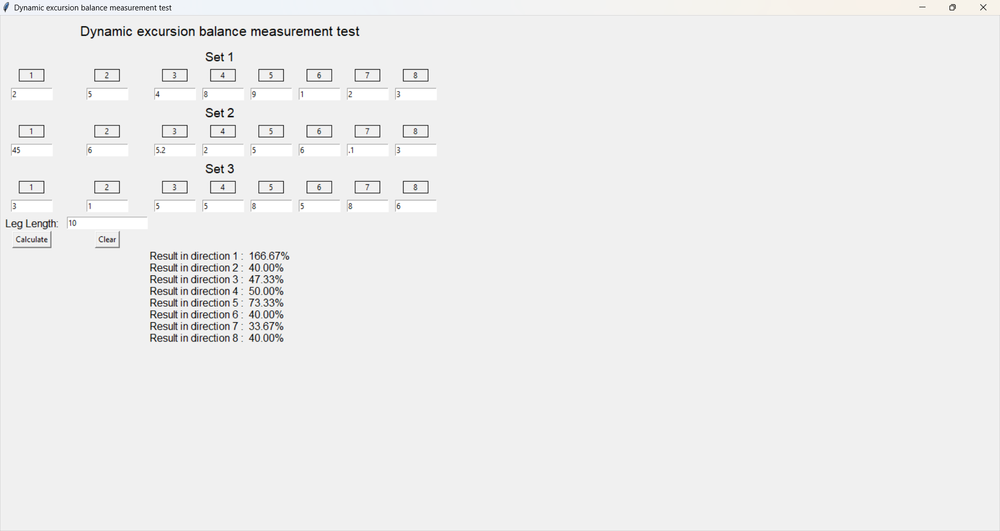

# Excursion Test

This project calculates results based on the following formula:

## Formula
\[
\text{Result} = \frac{\text{Average}}{\text{Leg Length}} \times 100
\]

### Formula Details
1. **Average Calculation**:
   For each set of values, the average is calculated using:
   \[
   \text{Average} = \frac{x_1 + x_2 + x_3}{n}
   \]
   where \(x_1\), \(x_2\), and \(x_3\) are values from each input set, and \(n\) is the number of values (in this case, 3).

2. **Final Result Calculation**:
   The final result is derived from the average using the formula:
   \[
   \text{Result} = \left(\frac{\text{Average}}{\text{Leg Length}}\right) \times 100
   \]
   Here, "Leg Length" is a constant value entered by the user, representing a reference length for calculating performance.

## Project Overview

The Excursion Test uses the above formula to compute a value indicating performance in a specific direction. This calculation helps in understanding and analyzing movement efficiency.

## Directory Structure

- **Build:** Contains the main executable and resources.
- **Images:** Includes visual representations and resources used in the project.

## Sample Image

## How to Run

1. Clone the repository.
2. Navigate to the `build` folder.
3. Execute the main program file `Excursion_Test.exe` and follow the prompts.

## Requirements

- There are no special requirements; it is just a simple Windows application.